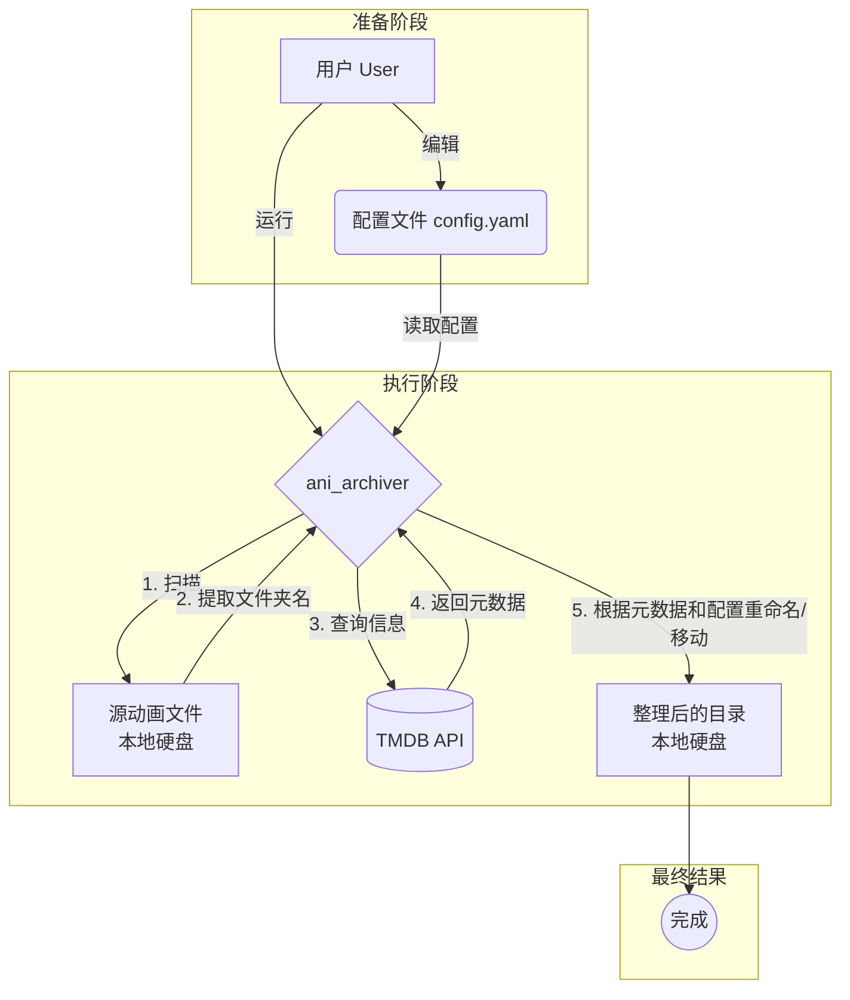
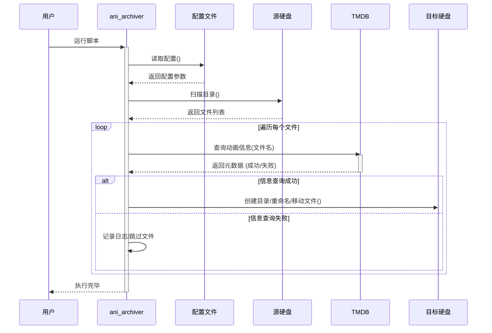

# Ani Archiver

[](https://codecov.io/gh/LFlops/ani-archiver)


A command-line tool to scrape TV show information from The Movie Database (TMDB), organize video files, and create NFO files for media centers like Kodi.

## Features

*   Scrapes TV show details from TMDB.
*   Organizes video files into a structured directory format.
*   Creates `tvshow.nfo` files compatible with media centers.
*   Caches TMDB IDs and file hashes to avoid redundant lookups.
*   Supports both season/episode and single file naming conventions.
## architecture 



## Usage

1.  **Clone the repository:**
    ```bash
    git clone https://github.com/your-username/ani-archiver.git
    cd ani-archiver
    ```

2.  **Create a `.env` file:**
    ```
    TMDB_API_KEY=your_tmdb_api_key
    ```

3.  **Run the archiver:**
    ```bash
    cargo run -- --source /path/to/your/shows --dest /path/to/organized/shows
    ```
4. **result **
* when program run successfully, it will output a message like this:
```shell
    - .nfo file created for show
    - .processed.json file created for marker the processed
```
## Testing and Coverage

This project uses `cargo test` for running unit and integration tests.

### Running Tests

To run the tests, use the following command:

```bash
cargo test
```

### Test Coverage

To generate a test coverage report, you can use `grcov`.

1.  **Install `grcov` and the necessary LLVM tools:**
    ```bash
    cargo install grcov
    rustup component add llvm-tools-preview
    ```

2.  **Run the tests with coverage enabled:**
    ```bash
    CARGO_INCREMENTAL=0 RUSTFLAGS="-Zprofile -Ccodegen-units=1 -Copt-level=0 -Clink-dead-code -Coverflow-checks=off -Zpanic_abort_tests -Cpanic=abort" RUSTDOCFLAGS="-Cpanic=abort" cargo test
    ```

3.  **Generate the coverage report:**
    ```bash
    grcov . -s . --binary-path ./target/debug/ -t html --branch --ignore-not-existing -o ./target/debug/coverage/
    ```

This will generate an HTML report in the `target/debug/coverage/` directory.