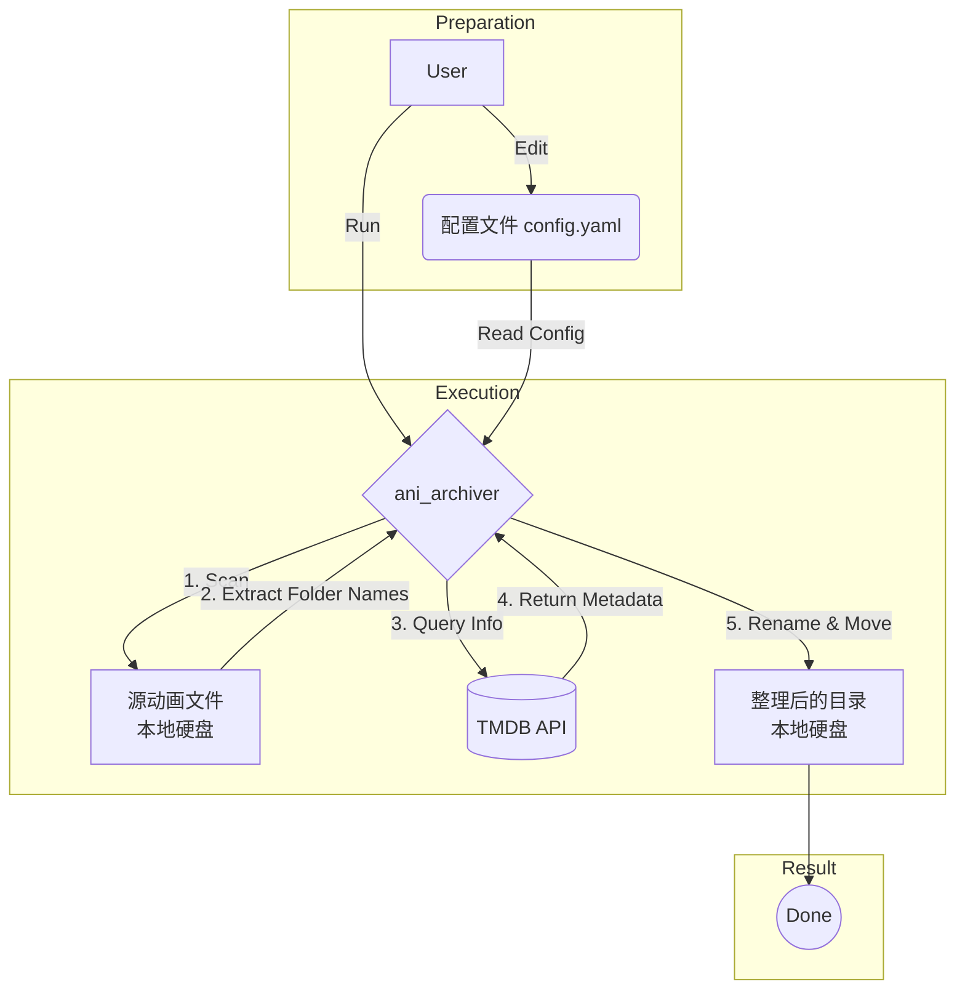
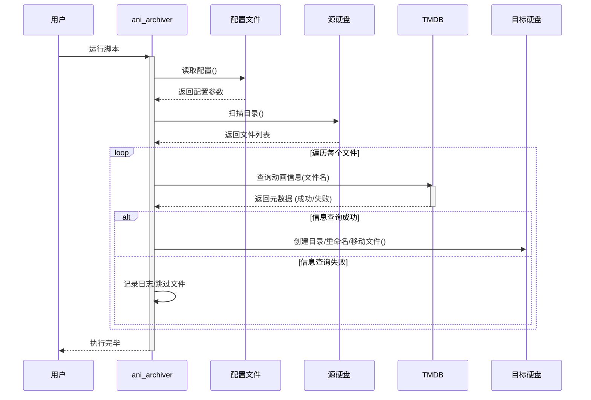

# Ani Archiver

[](https://codecov.io/gh/LFlops/ani-archiver)
[](https://github.com/LFlops/ani-archiver)
[](https://www.rust-lang.org/)

**Ani Archiver** is a command-line tool designed to scrape TV show information from The Movie Database (TMDB), organize video files, and create NFO files for media centers like Kodi.

---

## ✨ Features

* **Scrapes TV show details** from TMDB.
* **Organizes video files** into a structured directory format.
* **Creates `tvshow.nfo` files** compatible with media centers.
* **Caches TMDB IDs** and file hashes to avoid redundant lookups.
* **Supports multiple naming conventions** (both season/episode and single file).

---

## 🛠 Architecture

### Workflow Overview



### Process Sequence



---

## 🚀 Usage

### 1. Installation

Clone the repository:

```bash
git clone [https://github.com/your-username/ani-archiver.git](https://github.com/your-username/ani-archiver.git)
cd ani-archiver
```

### 2. Configuration

Create a `.env` file in the project root:

```properties
TMDB_API_KEY=your_tmdb_api_key
```

### 3. Run the Archiver

Execute the program using Cargo:

```bash
cargo run -- --source /path/to/your/shows --dest /path/to/organized/shows
```

!!! success "Expected Output"
When the program runs successfully, it will output messages indicating completion:

    * ✅ `.nfo` local_file created for show
    * ✅ `.processed.json` local_file created for marker the processed

---

## 🧪 Testing and Coverage

This project uses `cargo test` for running unit and integration tests.

### Running Tests

To run the tests, use the following command:

```bash
cargo test
```

### Test Coverage

To generate a test coverage report, you can use `grcov`.

**1. Install Dependencies:**

```bash
cargo install grcov
rustup component add llvm-tools-preview
```

**2. Run Tests with Coverage Enabled:**

```bash
CARGO_INCREMENTAL=0 RUSTFLAGS="-Zprofile -Ccodegen-units=1 -Copt-level=0 -Clink-dead-code -Coverflow-checks=off -Zpanic_abort_tests -Cpanic=abort" RUSTDOCFLAGS="-Cpanic=abort" cargo test
```

**3. Generate HTML Report:**

```bash
grcov . -s . --binary-path ./target/debug/ -t html --branch --ignore-not-existing -o ./target/debug/coverage/
```

!!! tip "View Report"
Open `target/debug/coverage/index.html` in your browser to view the detailed coverage report.